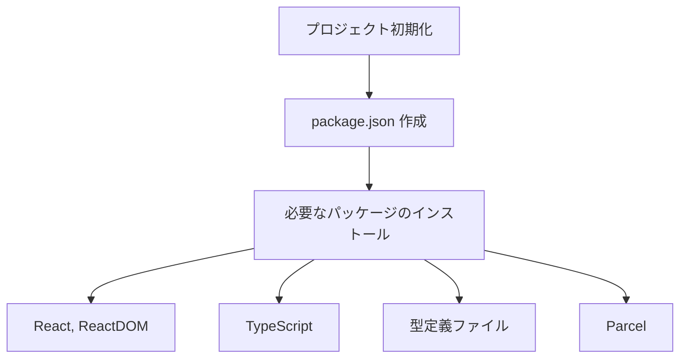
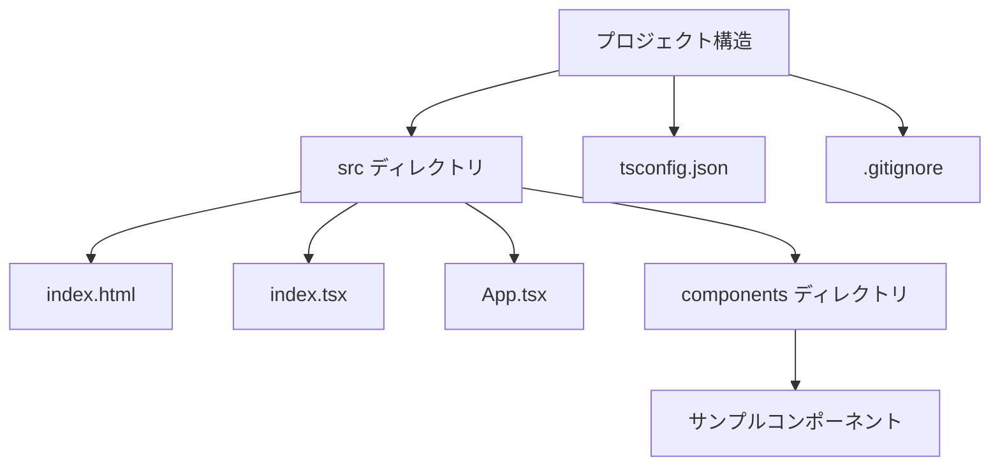
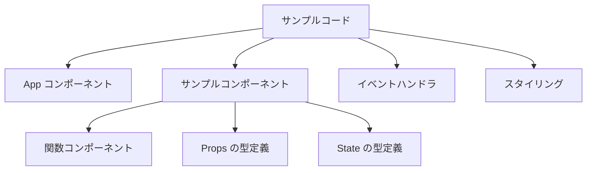
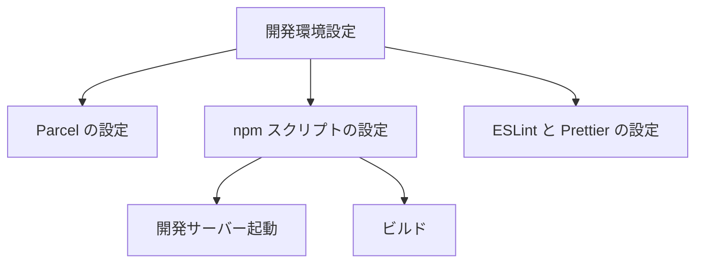

# React.js と TypeScript 入門プロジェクト計画

## 1. プロジェクト初期化と必要なパッケージのインストール

必要なパッケージ:
- react, react-dom: React の基本ライブラリ
- typescript: TypeScript コンパイラ
- @types/react, @types/react-dom: React の型定義
- parcel: バンドラー

## 2. プロジェクト構造の作成

## 3. TypeScript の設定

tsconfig.json を作成して、TypeScript のコンパイルオプションを設定します。主な設定項目:
- JSX サポート
- モジュールシステム
- 厳格な型チェック
- ターゲット ECMAScript バージョン

## 4. 基本的なサンプルコード

サンプルコードには以下の要素を含めます:
- 関数コンポーネントの作成方法
- Props と State の型定義
- イベントハンドラの型付け
- 条件付きレンダリング
- リストのレンダリング

## 5. 開発環境の設定

## 6. 学習ステップ

1. プロジェクト設定を理解する
2. 基本的なコンポーネントの作成と型定義
3. Props と State の操作
4. イベント処理
5. コンポーネントのライフサイクル（useEffect など）
6. カスタムフックの作成

## 7. 発展的な学習トピック

- コンテキストAPI
- Redux/Zustand などの状態管理
- スタイリングソリューション（CSS Modules, Styled Components など）
- テスト（Jest, React Testing Library）
- パフォーマンス最適化